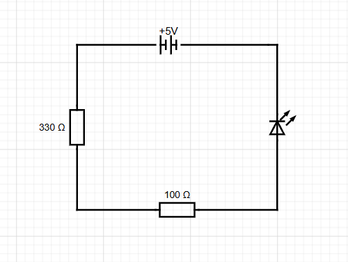

# LED circuit

## Aim
To create a circuit using;
- 9V battery
- Resistor(s)
- LED
- Jumper wires
- Breadboard

## Setup
Started with some breadboard research and trial and error to understand the layout and use of a breadboard.
Research how to calculate the resistors required (and why they're required).
I calculated the resistance required to be 360 ohms but didn't have a 360 ohms resistor.
R = battery voltage 9V - LED forward voltage 1.8V / LED operating current 0.02 amps
I read that resistors place in series sum. So I used a 330 and 100 ohms resistors in series.

## Testing
The LED lit up to confirm the circuit was working correctly.

### Voltage

The voltage of the battery was 9V as expected.
The voltage over the led 2.056V
The voltage over the 330 ohm resistor was 5.490V
The voltage over the 100 ohm resistor was 1.626V

2.056V + 5.490V + 1.626V = 9.172V

Close enough for a first try.